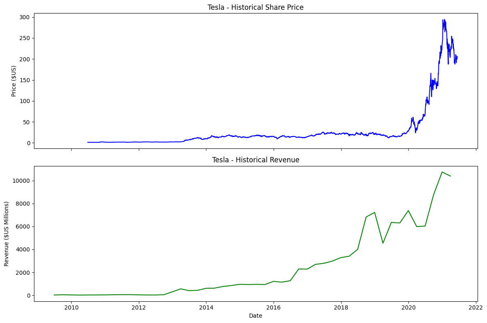
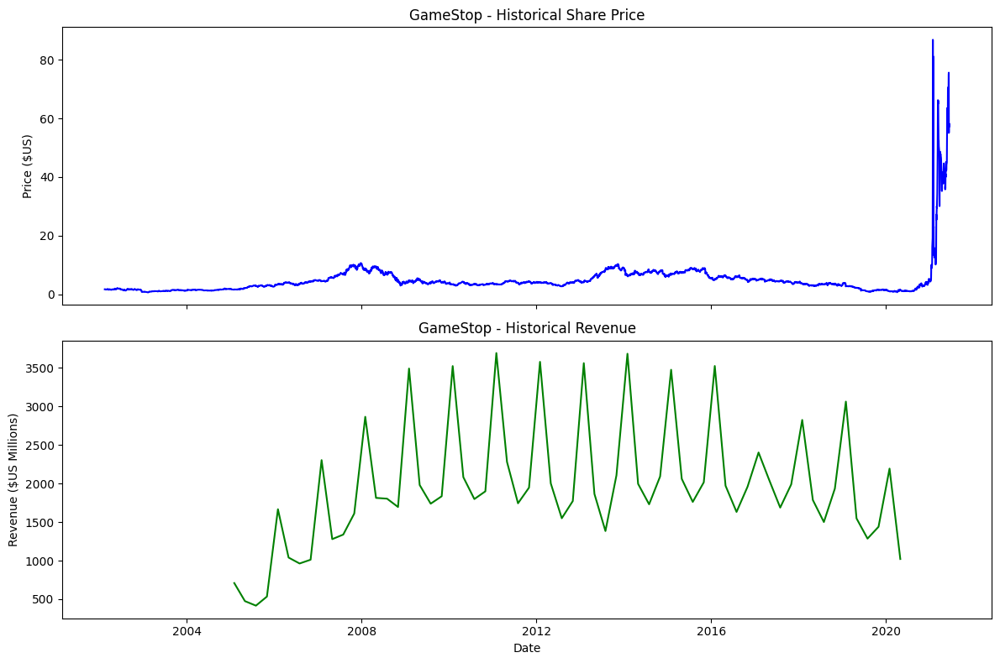

# Stock Revenue Analysis Dashboard 📈

A data science project focused on analyzing the relationship between stock prices and quarterly revenue for technology companies (Tesla & GameStop).

This pr

## Visualizations

*Figure 1: Comparison of TSLA share price and revenue trends.*

*Figure 2: Comparison of GME share price and revenue trends.*

## Features
- **Data Extraction:** Historical stock data retrieved via `yfinance` [web:2].
- **Web Scraping:** Quarterly revenue data extracted from HTML reports using `BeautifulSoup4`.
- **Data Visualization:** Comparative dashboards built with `Matplotlib`.

## Getting Started
1. Clone the repository:
   git clone https://github.com/oolender/stock_revenue_analysis

2. Install dependencies:
   pip install -r requirements.txt

3. Run the notebook:
   jupyter notebook Revenue-Data-and-Building-a-Dashboard.ipynb

4. Technologies
Language: Python
Libraries: Pandas, Matplotlib, BeautifulSoup4, YFinance, Requests

## Certification & Acknowledgements
This project was completed as part of the **"Python Project for Data Science"** course by **IBM** on **Coursera**. 

- **Final Project Grade:** 100% 
- **Certificate of Completion:** [View Certificate](https://www.coursera.org/account/accomplishments/verify/U59FRU06SUMQ)

*Special thanks to the IBM Skills Network for providing the datasets and project framework.*
